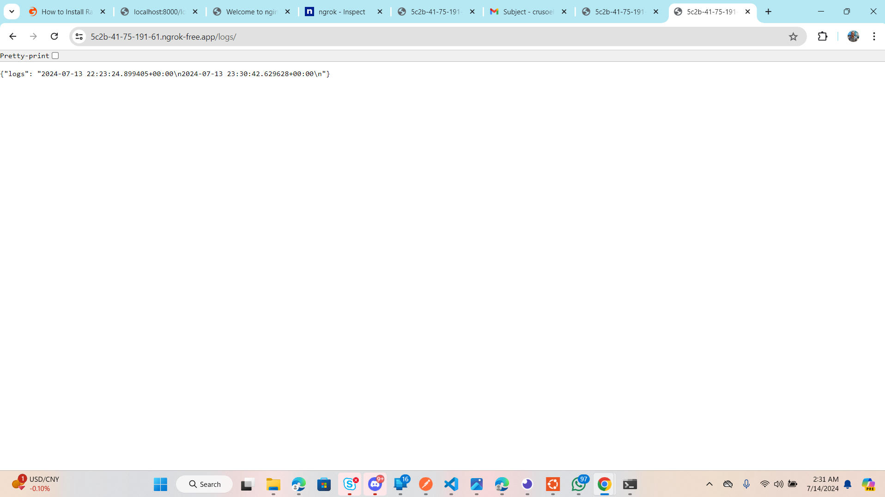

# Django Messaging System with RabbitMQ/Celery

This project implements a Django application behind Nginx that interacts with RabbitMQ/Celery for email sending and logging functionalities.

## Setup Instructions

### Local Setup

1. **Install RabbitMQ and Celery:**
   - Follow installation instructions for RabbitMQ.
   ---I'm on Mac so I'm going to use brew
   ```zsh
   brew update
   brew install rabbitmq
   ```
   - Install Celery using pip.
   ```zsh
   pip install celery
   ```

2. **Setting up Django Project:**
   - Initialize Django and activate the virtual environment.
   -- Prepare virtual environment
   ```zsh
   python3 -m venv env
   ```
   - Activate vitual environment
   ```zsh
   source env/bin/activate
   ```
   --------------------------------------------
   - Install Django in the virtual environment
   ```zsh
   python -m pip install django
   ```
   - Create requirements.txt for version control
   ```zsh
   python -m pip freeze > requirements.txt
   ```
   - Create django project
   ```zsh
   django-admin startproject celerycourier .
   ```
   - Start django app
   ```zsh
   python manage.py startapp messagehandler 
   ```
--------------------------------------------------

### Endpoint Functionalities

#### `/?sendmail` Endpoint

- Description: Allows sending emails using SMTP and queues tasks with RabbitMQ/Celery.

#### `/?talktome` Endpoint

- Description: Logs the current time to `/var/log/messaging_system.log`.

#### `/logs` Endpoint

- Description: Access application logs.

### Nginx Configuration

- Configure Nginx to serve the Django application and route requests correctly.
Nginx Configuration
Nginx Setup:

Nginx is used as a reverse proxy to direct requests to the Django application running on port 8000. Below is the Nginx configuration I used (sudo nano /etc/nginx/sites-available/django-app):

```nginx
server {
    listen 80;
    server_name localhost;

    location / {
        proxy_pass http://localhost:8000;
        proxy_set_header Host $host;
        proxy_set_header X-Real-IP $remote_addr;
        proxy_set_header X-Forwarded-For $proxy_add_x_forwarded_for;
        proxy_set_header X-Forwarded-Proto $scheme;
    }

    location /static/ {
        alias /Users/henrique/Desktop/HNG/CeleryCourier/celerycourier/static/;
    }

    location /media/ {
        alias /Users/henrique/Desktop/HNG/CeleryCourier/celerycourier/media/;
    }

    location /sendmail/ {
        proxy_pass http://localhost:8000/sendmail/;
        proxy_set_header Host $host;
        proxy_set_header X-Real-IP $remote_addr;
        proxy_set_header X-Forwarded-For $proxy_add_x_forwarded_for;
        proxy_set_header X-Forwarded-Proto $scheme;
    }

    location /talktome/ {
        proxy_pass http://localhost:8000/talktome/;
        proxy_set_header Host $host;
        proxy_set_header X-Real-IP $remote_addr;
        proxy_set_header X-Forwarded-For $proxy_add_x_forwarded_for;
        proxy_set_header X-Forwarded-Proto $scheme;
    }

    location /logs/ {
        proxy_pass http://localhost:8000/logs/;
        proxy_set_header Host $host;
        proxy_set_header X-Real-IP $remote_addr;
        proxy_set_header X-Forwarded-For $proxy_add_x_forwarded_for;
        proxy_set_header X-Forwarded-Proto $scheme;
    }

    access_log /var/log/nginx/django-app.access.log;
    error_log /var/log/nginx/django-app.error.log;
}
```
Create a symbolic link from sites-available to sites-enabled to enable the Nginx configuration:
```bash
sudo ln -s /etc/nginx/sites-available/django-app /etc/nginx/sites-enabled/
```
Restart Nginx
```bash
sudo systemctl restart nginx
```


### Testing

- Test functionality of `/?sendmail`, `/?talktome`, and `/logs` endpoints.
- Ensure Nginx is correctly routing requests.

## Screenshots and Video Walk-through

- Add screenshots of endpoint functionality.





## Authors

- Geitodyu Henrique Crusoe ("https://github.com/Cruso003")

Thank You!

